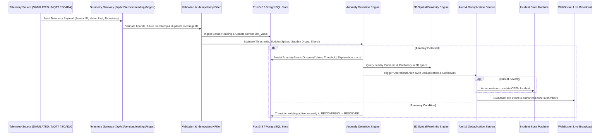

# TRINETRA Telemetry & Anomaly Intelligence Architecture (Phase 2)

**Version:** 1.0.0-phase2  
**System:** AI-Based Smart Governance & Compliance Monitoring System for Coal Mines

---

## 1. Operational Telemetry Pipeline

---

## 2. Deterministic Anomaly Detection Classifications

| Anomaly Type | Evaluation Condition | Severity | Governance Consequence |
|---|---|---|---|
| **THRESHOLD_EXCEEDED** | Observed value $\ge$ configured critical threshold or $\ge$ warning threshold | `CRITICAL` or `WARNING` | Immediate alert generated; Critical auto-creates an operational incident. |
| **SUDDEN_SPIKE** | Positive jump $\Delta \ge 40\%$ of warning threshold in 1 step above baseline | `HIGH` / `MEDIUM` | Early warning flag for transient gas leakage / bearing friction. |
| **SUDDEN_DROP** | Sudden drop $\ge 45\%$ below normal operating minimum | `HIGH` | Immediate warning for auxiliary ventilation fan stalls or pressure loss. |
| **RAPID_UPWARD_TREND** | 3 consecutive strictly increasing readings above normal baseline | `MEDIUM` | Predictive drift warning before statutory threshold breach. |
| **SENSOR_OFFLINE** | No telemetry heartbeat received within dormancy threshold ($>20$m) | `MEDIUM` | **Silence-to-Risk** signal flagged for field verification. |
| **RECOVERING** | Value returns and stabilizes below warning threshold | `LOW` | Anomaly transitioned to `RECOVERING`; incident remains open for human verification. |

---

## 3. 3D Spatial Proximity Discovery

Given an anomaly at coordinates $(x_t, y_t, z_t)$, the `SpatialContextService` computes Euclidean distance:
$$d = \sqrt{(x_t - x_a)^2 + (y_t - y_a)^2 + (z_t - z_a)^2}$$
- **Nearby Cameras:** Identified within radius (sorted by proximity), returning camera code, orientation ($yaw, pitch, fov$), and simulated stream URL.
- **Nearby Equipment:** Machinery (Shearers, Continuous Miners, Ventilation Fans) within radius, returning status and distance.

---

## 4. Credibility & Data Source Distinctions

| Feature | Current Prototype Status | Future Production Integration |
|---|---|---|
| **Sensor Telemetry** | **SIMULATED** (Deterministic time-series scenarios) | **MQTT Broker** / Industrial SCADA PLC interface |
| **CCTV Feeds** | **SIMULATED CAMERA METADATA** ($yaw, pitch, fov, x, y, z$) | **RTSP / ONVIF / WebRTC** streaming gateways |
| **Risk Scoring** | **Deterministic Rule & Telemetry Engine** | Hybrid ML risk modeling + reporting drift |
| **3D Digital Twin** | **Backend Spatial REST API** ($x, y, z$) | Interactive Three.js WebGL rendering |
